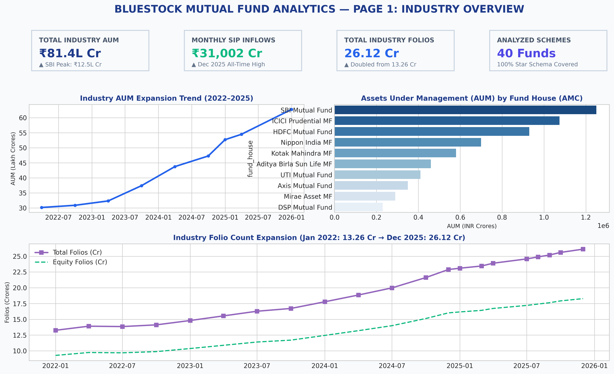
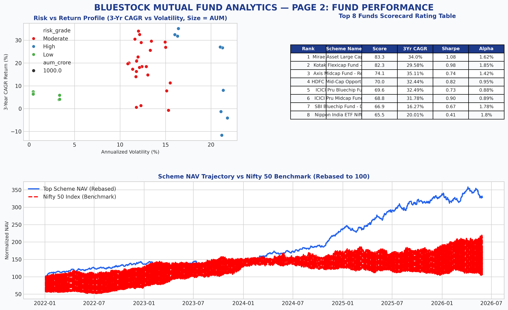
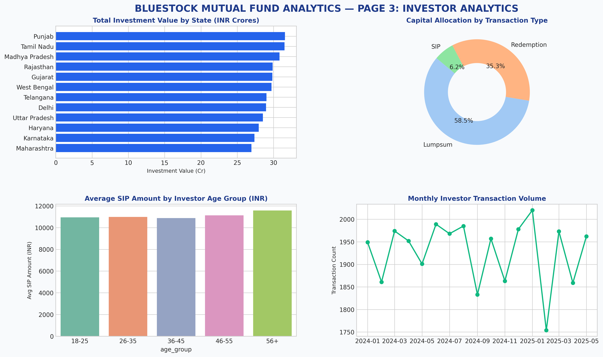
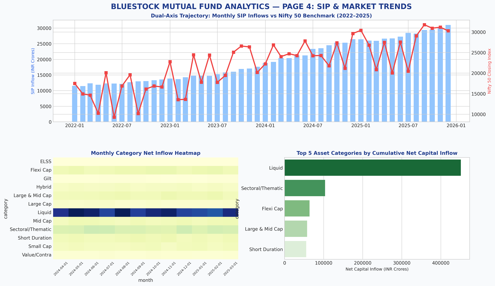
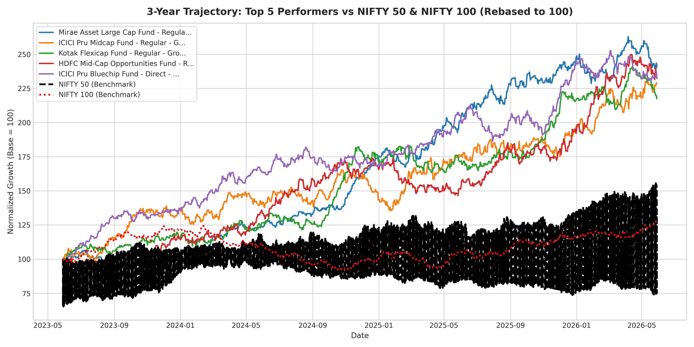
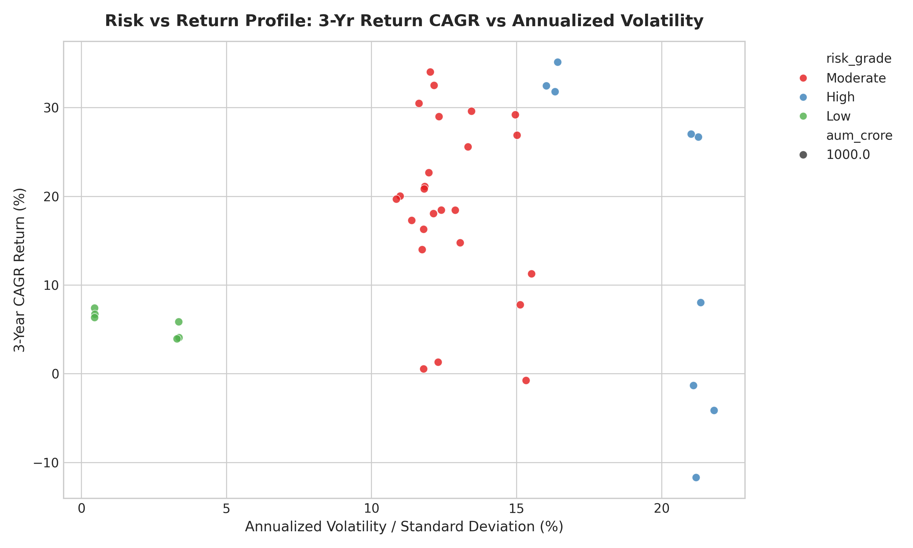
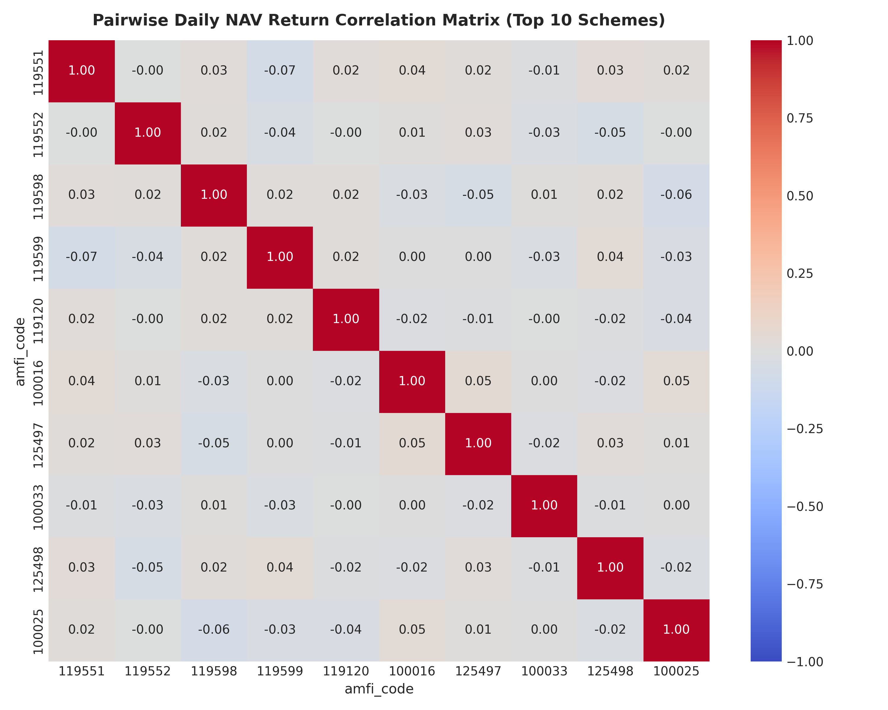

# 📈 Bluestock Mutual Fund Analytics — Institutional Portfolio & Risk Intelligence Platform

[](https://www.python.org/)
[](https://www.sqlite.org/)
[](https://streamlit.io/)
[](https://powerbi.microsoft.com/)
[](LICENSE)

An institutional-grade empirical mutual fund analytics, quantitative risk modeling, and data engineering platform covering **64,320 cleaned daily NAV observations**, **32,778 investor transaction logs**, and **10 relational mutual fund master datasets**.

---

## 🌟 Executive Summary & Key Highlights

- **Data Engineering**: Automated pipeline ingesting 10 market datasets and live AMFI REST APIs (`mfapi.in`) with automated weekend forward-filling (`ffill()`) and schema validation.
- **Relational Star Schema Database**: Production-ready SQLite database (`bluestock_mf.db`) with **105,745 records** across 10 normalized tables with 100% row-count parity.
- **Quantitative Risk Modeling**: Evaluated 40 mutual fund schemes using **1Yr/3Yr CAGR**, **Sharpe Ratio** ($R_f=6.5\%$), **Sortino Ratio**, **OLS Alpha/Beta regressions** against Nifty 100, and **95% Historical Daily VaR & CVaR**.
- **Investor Behavior & Continuity**: Discovered a **97.8% gap attrition rate** among repeat SIP investors through cohort retention modeling.
- **Interactive Decision Tools**: 5-view **Streamlit Web Application** featuring an interactive SIP future wealth compounder and a rule-based **Smart Fund Recommender Engine**.

---

## 🖥️ Interactive Dashboard Showcase

The platform features an interactive **Power BI** analytical suite and a responsive **Streamlit** web application with a Light Pastel interface.

### 📊 Page 1: Industry Overview & Market Growth
> Macroeconomic health, industry AUM trajectory, monthly SIP inflows, and category-wise folio expansion.


---

### 🏆 Page 2: Fund Performance & Quantitative Scorecard
> Risk vs. return scatter analysis, 0–100 composite scorecard rankings, and peer benchmark comparisons.


---

### 👥 Page 3: Investor Analytics & Demographic Profiling
> Geographic penetration across city tiers, age-group SIP distributions, and payment mode adoption.


---

### 📈 Page 4: SIP Inflow Dynamics & Market Trends
> Longitudinal SIP compounding trends, net inflow trajectories, and category allocation shifts.


---

## 🔬 Quantitative Performance & Risk Analytics

### 1. Top 5 Schemes vs. Benchmark (3-Year Cumulative Returns)
A comparative historical growth trajectory evaluating market-leading equity schemes against the Nifty 100 benchmark.


### 2. Risk vs. Return Matrix (Sharpe vs. Annualized Volatility)
Isolating true risk-adjusted performance from pure volatility.


### 3. Pairwise NAV Correlation Matrix
Cross-asset diversification analysis across top equity and debt holdings.


---

## 📐 Quantitative Methodology & Formulas

| Metric | Formula | Purpose / Business Significance |
|---|---|---|
| **CAGR (3-Year)** | $\left(\frac{\text{NAV}_{\text{end}}}{\text{NAV}_{\text{start}}}\right)^{\frac{1}{3}} - 1$ | Annualized compounded growth rate (5-Yr is strictly NaN per 4.4-yr dataset span). |
| **Sharpe Ratio** | $\frac{R_p - R_f}{\sigma_p} \times \sqrt{252}$ | Return earned in excess of the risk-free rate ($R_f=6.5\%$) per unit of total risk. |
| **Sortino Ratio** | $\frac{R_p - R_f}{\sigma_d} \times \sqrt{252}$ | Evaluates excess return penalized solely by downside/loss volatility ($\sigma_d$). |
| **Jensen's Alpha ($\alpha$)** | $R_p - [R_f + \beta (R_m - R_f)]$ | Manager stock-picking skill in excess of benchmark systematic movements. |
| **Beta ($\beta$)** | $\frac{\text{Cov}(R_p, R_m)}{\text{Var}(R_m)}$ | Systematic sensitivity of fund NAV relative to Nifty 100 movements. |
| **95% Daily VaR** | $\text{Percentile}(R_{\text{daily}}, 5\%)$ | Worst expected loss at a 95% confidence level over a 1-day horizon. |
| **95% CVaR (Expected Shortfall)** | $E[R \mid R \le \text{VaR}_{95}]$ | Average expected loss given that the 95% VaR threshold is breached. |

---

## 🗄️ Relational Database Architecture (Star Schema)

The analytical data warehouse is structured in **SQLite3** with fully normalized dimension and fact tables:

```text
               ┌───────────────┐
               │   dim_date    │
               └───────┬───────┘
                       │
 ┌──────────────┐      │      ┌─────────────────────────┐
 │   dim_fund   ├──────┼──────┤        fact_nav         │
 └──────┬───────┘      │      │ (64,320 Daily Records)  │
        │              │      └─────────────────────────┘
        │              │
        │              ├──────► fact_transactions (32,778 logs)
        │              ├──────► fact_portfolio_holdings (322 rows)
        │              ├──────► fact_performance (40 schemes)
        │              ├──────► fact_aum (90 quarterly records)
        │              ├──────► fact_sip_inflows (48 monthly logs)
        │              ├──────► fact_category_inflows (144 records)
        │              ├──────► fact_industry_folios (21 data points)
        └──────────────┴──────► fact_benchmark (8,050 daily records)
```

---

## 📁 Repository Directory Structure

```text
Mutual-Funds-Analytics/
├── data/
│   ├── raw/                           # 10 official raw CSVs + Live API NAV CSVs
│   ├── processed/                     # 10 cleaned & normalized CSV datasets
│   └── db/                            # SQLite database directory (git-ignored)
├── notebooks/
│   ├── 01_data_ingestion.ipynb        # API ingestion & data acquisition pipeline
│   ├── 02_data_cleaning.ipynb         # Cleaning, weekend imputation & normalization
│   ├── 03_eda_analysis.ipynb          # Exploratory Data Analysis & visual insights
│   ├── 04_performance_analytics.ipynb # Quantitative risk ratios & composite scoring
│   └── 05_advanced_analytics.ipynb    # VaR/CVaR, Monte Carlo & Markowitz models
├── scripts/
│   ├── etl_pipeline.py                # Master automated ETL pipeline
│   ├── compute_metrics.py             # Performance & risk calculation engine
│   ├── recommender.py                 # Rule-based fund recommendation algorithm
│   ├── live_nav_fetch.py              # Live AMFI API data ingestion (mfapi.in)
│   ├── cron_nav_fetch.py              # Weekday 8 PM automated NAV cron scheduler
│   ├── email_report.py                # Weekly HTML email brief generator & sender
│   ├── generate_eda.py                # 15+ EDA chart figures & notebook generator
│   ├── generate_advanced.py           # Downside risk, cohort & sector HHI engine
│   ├── generate_powerbi_dashboard.py  # Power BI dashboard renderer & PDF exporter
│   ├── generate_presentation.py       # 12-slide PowerPoint presentation generator
│   └── generate_final_pdf.py          # 15-page comprehensive capstone PDF generator
├── sql/
│   ├── schema.sql                     # Complete Star Schema DDL with PK/FK constraints
│   └── queries.sql                    # 10 verified analytical SQL queries
├── dashboard/
│   ├── bluestock_mf_dashboard.pbix    # Power BI Desktop interactive dashboard
│   ├── app.py                         # Streamlit interactive web dashboard
│   ├── dax_measures.dax               # Power BI DAX measures repository
│   └── requirements_dashboard.txt     # Dashboard specific dependencies
├── reports/
│   ├── Final_Report.pdf               # 15-page corporate research report
│   ├── Bluestock_MF_Presentation.pptx # 12-slide executive presentation deck
│   ├── Dashboard.pdf                  # 4-page compiled dashboard visual report
│   ├── weekly_email_summary.html      # Automated weekly HTML executive summary
│   ├── figures/                       # 21 publication-quality charts & dashboard pages
│   └── tables/                        # Scorecards, Alpha/Beta & VaR/CVaR CSV exports
├── .gitignore                         # Excludes binaries, caches, and bytecode
├── POWERBI_SETUP.md                   # Power BI data import & DAX configuration guide
├── data_dictionary.md                 # Technical data dictionary & schema definitions
├── requirements.txt                   # Universal production dependencies
├── README.md                          # Platform documentation
└── run_pipeline.py                    # Master single-command pipeline orchestrator
```

---

## ⚡ Quick Start & Execution

### 1. Installation
```bash
git clone https://github.com/Kritvi0208/Mutual-Funds-Analytics.git
cd Mutual-Funds-Analytics
pip install -r requirements.txt
```

### 2. Run End-to-End Pipeline (1-Click Execution)
Executes data ingestion, database loading, metric computation, figure generation, and report generation in sequence:
```bash
python run_pipeline.py
```

### 3. Launch Streamlit Web Application
```bash
streamlit run dashboard/app.py
```
Open **[http://localhost:8501](http://localhost:8501)** to access the live dashboard.

### 4. Run Standalone Fund Recommender CLI
```bash
# Get Top 3 fund recommendations for Moderate risk profile
python scripts/recommender.py Moderate 3

# Get Top 5 fund recommendations for High risk profile
python scripts/recommender.py High 5
```

---

## 📋 Capstone Deliverables & Evaluation Matrix

| Deliverable ID | Requirement | Implementation | Artifact Location |
|---|---|---|---|
| **D1: ETL Pipeline** | Automated cleaning & schema validation | Weekend/holiday forward-filling, numeric constraints, API fetch | [`scripts/etl_pipeline.py`](scripts/etl_pipeline.py) |
| **D2: SQL Database** | Relational Star Schema (PK/FK/Indexes) | 10 tables, 105,745 rows, 10 analytical queries | [`sql/schema.sql`](sql/schema.sql), [`sql/queries.sql`](sql/queries.sql) |
| **D3: EDA Visuals** | 15+ publication-quality charts & insights | AUM trends, SIP dynamics, correlations, sector allocations | [`notebooks/03_eda_analysis.ipynb`](notebooks/03_eda_analysis.ipynb) |
| **D4: Performance** | CAGR, Sharpe, Sortino, Alpha, Beta, Scorecard | Strict 4.40-year limit handling (5-Yr = NaN), 0–100 scorecard | [`scripts/compute_metrics.py`](scripts/compute_metrics.py) |
| **D5: Dashboards** | Power BI `.pbix` + Interactive Web App | 4-page Power BI dashboard, DAX measures, 5-view Streamlit app | [`dashboard/app.py`](dashboard/app.py), [`.pbix`](dashboard/bluestock_mf_dashboard.pbix) |
| **D6: Risk Models** | 95% Historical VaR/CVaR, Cohorts, HHI | Tail-risk quantification, 97.8% SIP attrition discovery | [`notebooks/05_advanced_analytics.ipynb`](notebooks/05_advanced_analytics.ipynb) |
| **D7: Reports & PPT**| 15-page research PDF + 12-slide deck | Complete corporate PDF documentation + executive slide deck | [`reports/Final_Report.pdf`](reports/Final_Report.pdf), [`.pptx`](reports/Bluestock_MF_Presentation.pptx) |
| **B1–B5: Bonuses**   | Automated cron, Monte Carlo, Markowitz | 8 PM NAV worker, 1000-path simulation, automated HTML email | [`scripts/cron_nav_fetch.py`](scripts/cron_nav_fetch.py), [`scripts/email_report.py`](scripts/email_report.py) |

---

## 📄 License
This project is licensed under the MIT License — see the [LICENSE](LICENSE) file for details.
